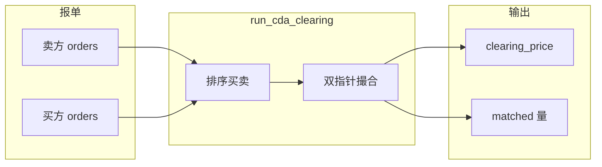

# 微电网氢能交易强化学习环境（CDA 市场 · v7）

本目录实现**多智能体、连续控制**的微电网氢能调度与**连续双向拍卖（CDA, Continuous Double Auction）**氢能交易：`MicrogridEnv` 提供常见 MARL 模板兼容的 `reset` / `step`（list 接口）；`MicrogridContinuousEnv` 提供 Gym `spaces` 与向量化友好的 `numpy` 张量输出，可与 HyperMARL 或其它训练脚本配合。

**当前配置版本为 v7**（见 `config.py` 顶部说明）：小时级时间步、MW 量级设备、24 步/日、分时电价与奖励标幺已随之一致更新。

---

## 目录与职责

| 文件 | 说明 |
|------|------|
| `config.py` | 全局常量：`MICROGRID_CONFIG`、分时电价 `get_tou_price` / `build_tou_table(episode_length=...)` |
| `microgrid_env.py` | 核心环境类 `MicrogridEnv`：`reset` / `step` / 观测与奖励 |
| `microgrid_continuous_env.py` | Gym 封装 `MicrogridContinuousEnv`，输出堆叠为 `numpy` 张量 |
| `cda_market.py` | 无状态 CDA 出清 `run_cda_clearing`（量纲：**氢能 kWh 当量**） |
| `data_generator.py` | `generate_daily_profiles(config, rng)`：按 `episode_length`、`dt` 生成日内曲线 |
| `__init__.py` | 导出环境类 |

---

## 场景概述

- **4 个微电网智能体（MG1–MG4）**：索引 `0,1` 为**产氢者（producer）**，`2,3` 为**用氢消费者（consumer）**。
- **时间离散化（v7）**：每步 **`dt = 1.0` 小时**，一回合 **`episode_length = 24`** 步，对应 **24 小时**。外生曲线（PV/WT/负荷）与分时电价均按该步长索引。
- **功率与能量量级（v7）**：设备额定功率/容量在 **`config.py` 中按 MW 级（以 kW 数值写入，如 5000 kW = 5 MW）** 设定；送入网络的观测仍除以各自容量/峰值做归一化。
- **可再生能源**：PV、WT 出力为外生随机曲线。
- **储能**：电池动作为充放电功率，经 SOC 可充放功率 clip。
- **氢侧**：产氢者电解槽制氢；**MG2** 带氢储罐（`h2_tank_cap` 非零）。
- **掺混供热（氢 / 天然气）**：消费者热功率 `lh` 在步内积分得热需求 `E_thermal = lh × dt`（kWh_thermal）。其中比例 **`h2_thermal_share`（记为 α）** 由**氢锅炉**承担，对应所需氢化学能量  
  当前版本将负荷侧需求全部表述为氢负荷：`e_h2_load = E_thermal / η_boiler`（kWh_H2 当量）。未由内部 CDA 满足的氢能缺口按外部氢价计入 **外部购氢成本**。
- **市场**：CDA 仅针对**氢侧能量**报价（元/kWh）与报量（kWh）；出清见 `cda_market.py`。

---

## 物理与约束

### 电平衡

- **产氢者**：`P_grid = Load_e + P_el + P_charge − P_PV − P_WT − P_discharge`（购电为正）。
- **消费者**：无电解槽项，不含电热器等额外电负荷。

### 电解槽（耗电与产氢）

- **电网侧耗电**为智能体动作映射并经 clip 后的 **`P_el`（kW）**，直接计入电平衡。
- **产氢能量（kWh/步）**为 `e_h2_prod = P_el × el_eff × dt`（效率仅作用于氢产出，不替代耗电功率）。

### 氢平衡（仅 α 分额热需求）

> **氢侧能量需求** = 外部购氢 + CDA 买入 + 电解槽产氢 − 储氢罐净存入（概念上；实现按主体类型拆分。）

- **消费者**：`e_h2_load` 对应全部氢负荷需求；`e_h2_ext = max(0, e_h2_load − CDA 买入量)`（kWh）。
- **产氢者**：储罐按 **kg** 更新：`产氢(kg) = e_h2_prod / LHV`，卖出量由 CDA 成交量（kWh）换算；液位 clip 在 `[h2_min, h2_max]`。

物理可行性以 **clip** 为主，**不在奖励中加罚项**。策略输出在 `step` 开头对动作做 **`[-1, 1]` clip** 后再映射到物理量。

### 动作语义统一

- 所有智能体动作第 0 维均映射为电解槽功率；`el_cap[i] == 0` 时自动为 0。

---

## CDA 市场模块（`cda_market.py`）

`run_cda_clearing(sellers, buyers, default_price)` 为**纯函数**。

- **交易标的**：订单 `quantity` 与成交记录中的量均为 **kWh（氢能当量）**；储罐内部用 **kg** 时通过 `LHV_H2`（kWh/kg）与能量互转。
- **撮合规则**：买方按报价降序、卖方升序；若 `buyer.price >= seller.price`，成交价 `(p_buy + p_sell)/2`，成交量为双方剩余量最小值；最后一笔价为 `clearing_price`，无成交时用 `default_price`（环境中为上一拍出清价，首步为 `cda_price_init`）。

**返回值**（与环境 `info` 相关）包括：

| 键 | 含义 |
|----|------|
| `trades` | 每笔 `{buyer_id, seller_id, price, quantity}` |
| `clearing_price` | 本步出清价 |
| `buy_matched` / `sell_matched` | 各主体成交量（kWh） |
| `buy_cost` / `sell_revenue` | 各主体 CDA 支出 / 收入（元），用于 `info` 统计 |

在**团队共享奖励**下，全体买方 `buy_cost` 之和与全体卖方 `sell_revenue` 之和在网络无外部补贴时**数值相等**（内部转账）；**不进入 `total_cost`**。系统边际成本包括 **电网 `C_grid`、外部购氢 `C_h2`**（氢侧经 CDA 成交的部分由内部转账体现，氢侧缺口用外部氢市场兜底）。



---

## 观测空间（每智能体 10 维）

与 `MICROGRID_CONFIG["obs_dim"]` 一致。`_get_obs` 使用 `min(self.t, T-1)` 索引外生曲线（与 `step` 后时刻对齐方式一致）。

| 索引 | 含义 | 归一化说明 |
|------|------|------------|
| 0 | 当前 PV | `/ pv_cap`（0 容量时用安全除数 1） |
| 1 | 当前 WT | `/ wt_cap` |
| 2 | 电负荷 | `/ load_e_peak` |
| 3 | 热负荷 | `/ load_h_peak` |
| 4 | 电池 SOC | 已在 `[soc_min, soc_max]` |
| 5 | 氢储罐液位 | `/ h2_tank_cap` |
| 6 | 上一时刻 CDA 出清价 | 映射到 `[0,1]`，范围 `[cda_price_min, cda_price_max]` |
| 7 | `sin(2πt/T)` | 日内周期，`T = episode_length` |
| 8 | `cos(2πt/T)` | 同上 |
| 9 | 分时购电价 | `tou_buy[t] / 1.0`（与峰价 1.0 元/kWh 对齐） |

无效值经 `nan_to_num` 处理。

---

## 动作空间（每智能体 4 维）

环境将每维 **clip 到 `[-1, 1]`** 后映射：

| 索引 | 物理量 | 映射 |
|------|--------|------|
| 0 | 电解槽功率 `P_el` | `(a0+1)/2 * el_cap[i]`，再 `[0, el_cap]` |
| 1 | 电池功率 `P_bat` | `a1 * bat_power[i]`，再按 SOC clip |
| 2 | CDA 报价 | 线性映射到 `[cda_price_min, cda_price_max]` |
| 3 | CDA 相对交易量 | `(a3+1)/2 ∈ [0,1]` × 本步可卖/可买上限（kWh） |

---

## 奖励函数与 `info`

**共享标量奖励**（四智能体相同）：

\[
r_t = -\frac{C_{\mathrm{grid}} + C_{\mathrm{H2}} + C_{\mathrm{gas}}}{\texttt{reward\_scale}}
\]

- `C_grid`：`P_grid` 与分时购/售电价 × `dt`。
- `C_h2`：`lambda_h2 × Σ e_h2_ext`（CDA 未覆盖的氢侧能量，外部购氢）。

回合结束时若 `terminal_value_coef > 0`，叠加终端残值（SOC、储氢相对初始的变化，见 `microgrid_env.py`）。

**`info` 字段（节选，四份 dict 相同）**

| 键 | 说明 |
|----|------|
| `C_grid`, `C_h2`, `total_cost` | 成本分解与合计（元） |
| `cda_clearing_price` | 本步出清价 |
| `cda_total_traded` | 本步总成交量（kWh） |
| `cda_buy_cost` | 全体买方 CDA 支出之和（元） |
| `cda_sell_revenue` | 全体卖方 CDA 收入之和（元） |
| `cda_bonus` | 诊断项；当前不进入 reward |
| `terminal_value` | 终端残值项（非最后一步多为 0） |

**默认超参（见 `config.py`，可改）**：`reward_scale`、`lambda_h2_buy`、`lambda_h2_sell`、`h2_thermal_share_default = 1.0`。

---

## 分时电价（v7 · 24 步）

`get_tou_price(step_idx)` 中 `step_idx % 24` 对应一天中的**第几个小时**（0 = 00:00–01:00，…，23 = 23:00–24:00）：

- **谷**：steps `0–6`、`23` → buy 0.30 / sell 0.15（元/kWh）
- **平**：`7–9`、`15–17`、`21–22` → 0.60 / 0.35
- **峰**：`10–14`、`18–20` → 1.00 / 0.55

`build_tou_table(episode_length=None)` 默认按 `MICROGRID_CONFIG["episode_length"]` 预计算长度 `T` 的数组；若将来改 `episode_length`，应保证 `get_tou_price` 的索引语义与日程一致或另行改写。

---

## 数据生成（`data_generator.py`）

`generate_daily_profiles` 使用 `config["episode_length"]` 与 `config["dt"]` 生成 `hours = arange(T) * dt`，再生成各主体的 `pv`、`wt`、`load_e`、`load_h`（形状 `[num_agents, T]`）。固定 `MicrogridEnv.seed` 可复现曲线。

---

## 核心 API

### `MicrogridEnv`

- `reset()` → `list[np.ndarray]`，长度 4，各 `shape=(obs_dim,)`。
- `step(actions)` → `[obs_list, reward_list, done_list, info_list]`；`reward_list` 每项 `[scalar]`；`done_list` 同步。

### `MicrogridContinuousEnv`

- `reset()` → `np.ndarray`，`shape=(4, obs_dim)`。
- `share_observation_space`：拼接观测，维度 **`4 × obs_dim`（当前 40）**。

---

## 配置修改（`config.py`）

主要可调：`agent_types`、`pv_cap`、`wt_cap`、`bat_*`、`el_cap`、`el_eff`、`h2_tank_cap`、`load_*_peak`、`dt`、`episode_length`、`lambda_h2_buy`、`lambda_h2_sell`、`cda_price_*`、`reward_scale`，以及 `get_tou_price` 与 `build_tou_table` 逻辑。

修改 `obs_dim` / `action_dim` 时需同步 `microgrid_env.py` 观测构造与策略网络维度。

---

## 最小运行示例

```python
import numpy as np
from envs.microgrid.microgrid_env import MicrogridEnv

env = MicrogridEnv()
env.seed(42)
obs = env.reset()
done = False
while not done:
    actions = [np.random.uniform(-1, 1, size=(4,)).astype(np.float32) for _ in range(4)]
    obs, rews, dones, infos = env.step(actions)
    done = dones[0]
print("last info:", infos[0])
```

---

## 与训练代码的关系

本目录只保留微电网环境和数据。MATRPO baseline 算法已移动到 `HyperMARL-main/baselines/MATRPO/`。环境本身不依赖 PyTorch；HyperMARL 训练通过 `HyperMARL-main/baselines/utils/microgrid_vec_env.py` 调用这里的 `MicrogridContinuousEnv`。

---

## 版本说明

### v7（当前）

1. `dt = 1.0` h，`episode_length = 24`，分时电价按 24 步编制。  
2. 设备参数提升至 **MW 级**（仍以 kW 写入配置）。  
3. `lambda_h2`、`reward_scale`、`cda_shaping_coef` 随量级调整。  
4. 观测中日内编码为 **`sin/cos(2πt/T)`**，与 `T` 一致。  
5. `info` 增加 **`cda_buy_cost`、`cda_sell_revenue`**（基于 `cda_market` 的 `buy_cost` / `sell_revenue`）。  
6. **氢负荷建模**：当前负荷侧全部表述为氢负荷，`total_cost` 仅由外部电网和外部氢市场成本构成。

### v6 及以前（概念保留）

- 氢平衡、无电热器、TOU 观测、CDA 塑形、终端残值、动作 clip 等设计延续；v7 主要为**时间步、量级、电价表与可观测诊断字段**的升级。

---

## 常见问题

**Q：观测里 CDA 价格为何是「上一时刻」出清价？**  
A：本步动作决策后出清，`last_clearing_price` 在出清后更新，观测反映上一拍市场结果。

**Q：共享奖励下 CDA 买卖还要不要写进总成本？**  
A：内部转账在系统层面净额为零；`total_cost` 用电网 + 外部购氢 + 运维；`cda_buy_cost` / `cda_sell_revenue` 便于做**分主体或机制分析**，与 `total_cost` 含义不同。

**Q：CDA 塑形是否进入 reward？**
A：当前 reward 只使用基础运行成本；CDA bonus 仅作为 `info` 诊断项保留，不进入 reward。

---

更多训练与部署说明见项目根目录 `README.md`，以及 `HyperMARL-main/AGENTS.md`。
